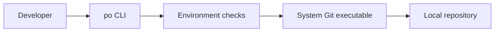

# po

<div align="center">


An experimental command-line abstraction over Git and GitHub workflows.

</div>



## Current behavior

The current implementation verifies that `git` is available on the system and establishes the internal package boundary for future Git operations.

## Prerequisites

- Go
- Git available on `PATH`

## Run from source

```bash
go run ./cmd/po
```

Expected output on a configured machine:

```text
git is installed! Ready to rock.
```

## Build

```bash
go build -o po ./cmd/po
./po
```

## Project layout

- `cmd/po/main.go` is the CLI entry point.
- `internal/git/git.go` wraps interactions with the system Git executable.

## Status

`po` is at the foundation stage. Repository initialization, remotes, commits, pushes, and GitHub operations are planned but are not yet exposed by the CLI.
